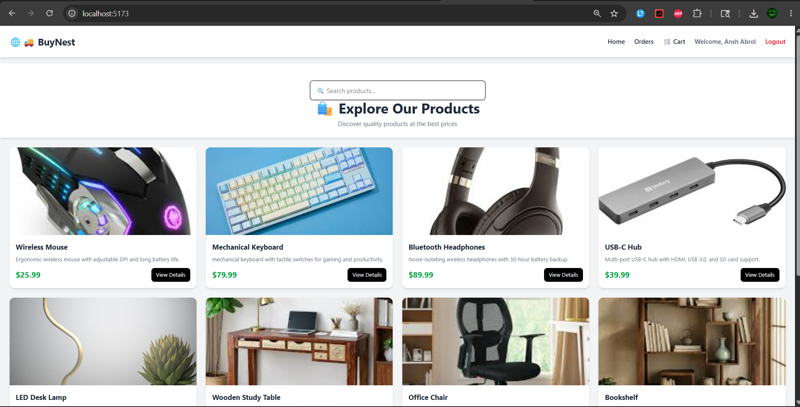
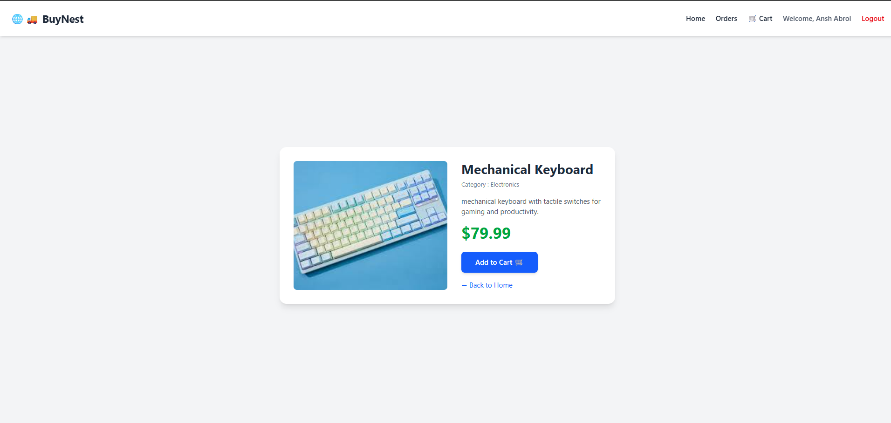
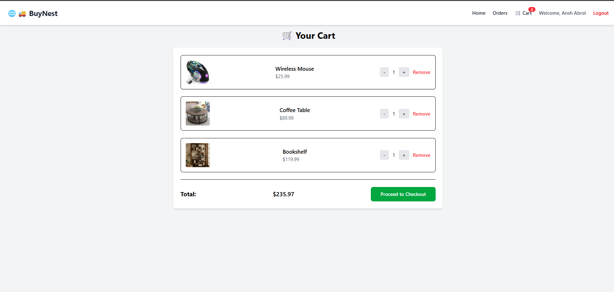
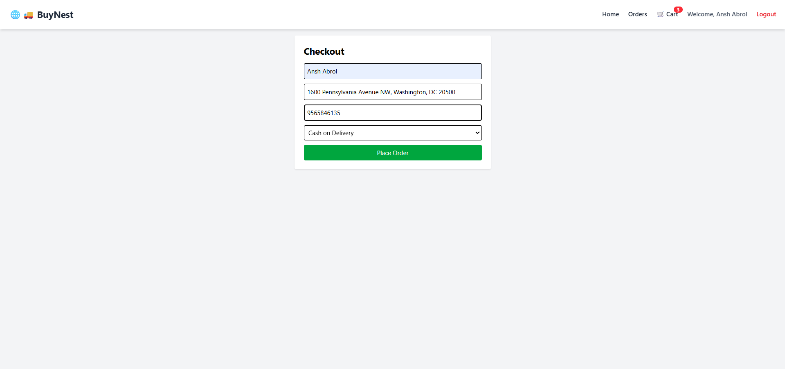
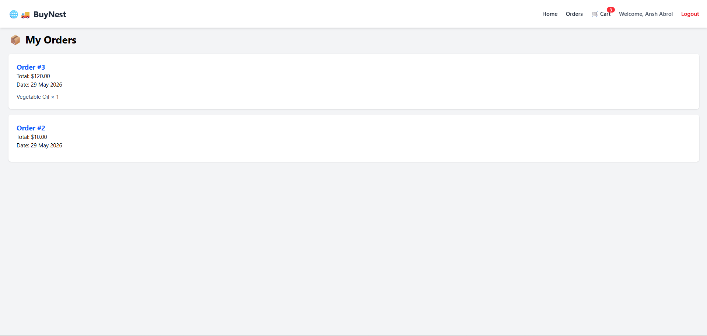
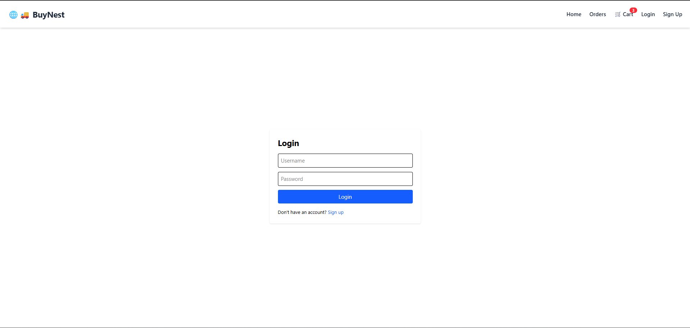

# 🌐🚚 BuyNest

A production-ready full-stack e-commerce platform built with React, Django REST Framework, PostgreSQL, JWT Authentication, Tailwind CSS, Cloudinary, Render, Vercel, and Neon PostgreSQL.

The platform allows users to browse products, search products, manage a shopping cart, place orders, and view their order history.

---

## 🚀 Features

### Authentication

* User Registration
* User Login
* JWT Authentication
* Protected Routes
* Automatic Token Refresh
* Logout Functionality

### Product Management

* Product Listing
* Product Details Page
* Category-Based Products
* Product Search Functionality

### Cart System

* Add to Cart
* Remove from Cart
* Update Product Quantity
* Dynamic Cart Total Calculation

### Checkout

* Checkout Form
* Order Creation
* Cart Clearing After Successful Order

### Orders

* View Previous Orders
* Order History Page
* Order Item Details

### User Experience

* Responsive Design
* Toast Notifications
* Modern UI using Tailwind CSS
* Fixed Navigation Bar
* Search Bar
* Product Cards
* Protected Checkout and Orders Pages

---

## 🛠️ Tech Stack

### Frontend

* React.js
* React Router DOM
* Tailwind CSS
* React Toastify
* Vite

### Backend

* Django
* Django REST Framework
* Simple JWT

### Database

* PostgreSQL

### Authentication

* JWT (JSON Web Tokens)

---

## 📂 Project Structure

```text
BuyNest/
│
├── backend/
│   ├── store/
│   ├── backend/
│   ├── manage.py
│   └── requirements.txt
│
├── frontend/
│   ├── src/
│   ├── public/
│   └── package.json
│
├── screenshots/
│
└── README.md
```
## 🌍 Live Demo

### Frontend

Deployed on Vercel

🔗 https://your-vercel-url.vercel.app

### Backend API

Deployed on Render

🔗 https://your-render-url.onrender.com

### Admin Panel

🔗 https://your-render-url.onrender.com/admin

---

## 🚀 Deployment Architecture

Frontend (React + Vite)
↓
Vercel

Backend (Django REST Framework)
↓
Render

Database
↓
Neon PostgreSQL

Image Storage
↓
Cloudinary

Authentication
↓
JWT (JSON Web Tokens)

The frontend communicates with the Django REST API hosted on Render. The backend stores data in Neon PostgreSQL and serves product images through Cloudinary.

---

## ☁️ Production Stack

| Service         | Platform        |
| --------------- | --------------- |
| Frontend        | Vercel          |
| Backend         | Render          |
| Database        | Neon PostgreSQL |
| Image Storage   | Cloudinary      |
| Authentication  | JWT             |
| Version Control | GitHub          |

---

## 📸 Screenshots

### Home Page



### Product Details



### Shopping Cart



### Checkout



### Order History



### Authentication



---

## ⚙️ Backend Setup

### Clone Repository

```bash
git clone <repository-url>
cd BuyNest
```

### Backend Setup

```bash
cd backend

python -m venv venv

venv\Scripts\activate

pip install -r requirements.txt
```

### Create Environment Variables

Create `.env`

```env
DB_NAME=your_database_name
DB_USER=your_database_user
DB_PASSWORD=your_database_password
DB_HOST=localhost
DB_PORT=5432
```

### Run Migrations

```bash
python manage.py makemigrations

python manage.py migrate
```

### Create Superuser

```bash
python manage.py createsuperuser
```

### Start Backend

```bash
python manage.py runserver
```

---

## 💻 Frontend Setup

```bash
cd frontend

npm install

npm run dev
```

---

## 🔑 Default Flow

```text
Browse Products
↓
View Product Details
↓
Add Product To Cart
↓
Checkout
↓
Place Order
↓
View Order History
```

---

## 🔮 Future Improvements

* Product Reviews & Ratings
* Wishlist Feature
* Online Payment Gateway Integration
* Order Status Tracking
* Admin Dashboard Analytics
* Product Pagination

---
## 🔐 Environment Variables

### Backend (.env)

SECRET_KEY=your_secret_key

DATABASE_URL=your_neon_database_url

CLOUDINARY_CLOUD_NAME=your_cloud_name

CLOUDINARY_API_KEY=your_api_key

CLOUDINARY_API_SECRET=your_api_secret

DEBUG=False

### Frontend (.env)

VITE_DJANGO_BASE_URL=https://your-render-url.onrender.com

---

## 👨‍💻 Author

Ansh Abrol

